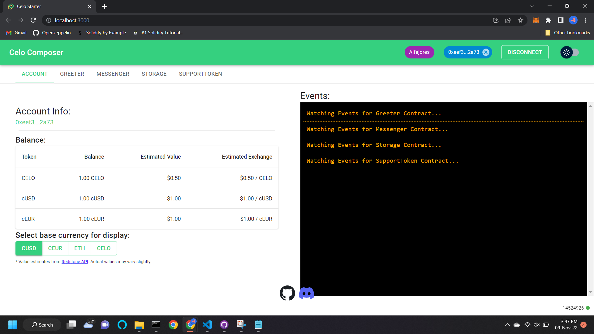
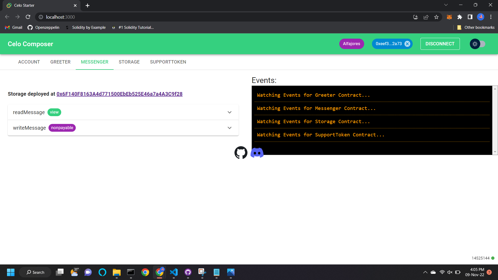
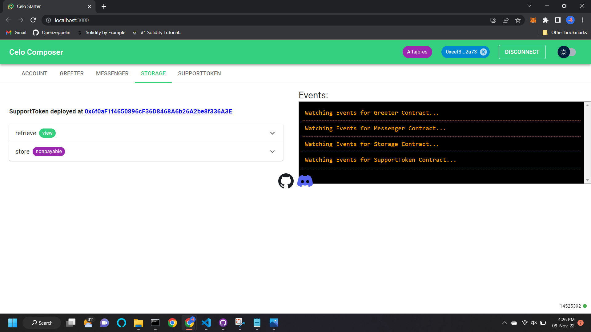

Hello Everyone, This is my Celo dApp which is created by using the celo-composer.

The output of the final dApp is attached below

#### Output

- Select the framework you like and please enter.

<ul>
  
<li><b>Accounts Tab</b> 

</li>
  
<li><b>Greeter Tab</b>
  <dl>

  </dl>
  
  <ul>
    <li>Setting the Greetings!!
      <dl>

.png)
      </dl>
    </li>
    <li>Getting the Greetings!!
      <dl>
.png)
      </dl>
    </li>
  </ul>
</li>
  
<li><b>Messenger Tab</b>
  <dl>

  </dl>
  
  <ul>
    <li>Setting the Message!!
      <dl>

.png)
      </dl>
    </li>
    <li>Getting the Message!!
      <dl>
    .png)
      </dl>
    </li>
  </ul>
</li>
    
<li><b>Storage Tab</b>
  <dl>

  </dl>
  
  <ul>
    <li>Setting the storage value!!
      <dl>

.png)
      </dl>
    </li>
    <li>Getting the storage value!!
      <dl>
.png)
      </dl>
    </li>
  </ul>
</li> 
      
</ul>
      
 <b>Dark Theme</b>

      
So that's all!!
Thank you for reading till here!!
